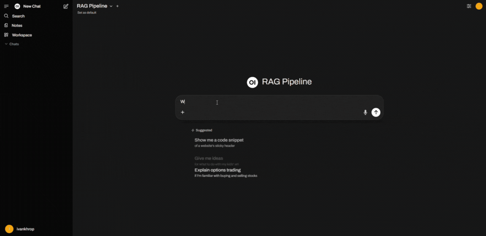

# 🔎 Multi-Language Retrieval-Augmented Generation (RAG)

This is a simplified and visual showcase of a custom **Retrieval-Augmented Generation (RAG)** pipeline. It supports querying documents in **multiple languages** and integrates with both a **Streamlit UI** and **OpenWebUI**.

---

## 🎯 What This Project Demonstrates

- 🔍 **Multi-language support** for both document content and user questions.
- 💬 Integration with **LLMs** to answer questions using internal documents.
- 📊 Visual preview of the project through interactive UIs.

---

## 🎥 UI Previews

### 🔹 Streamlit Interface

### 🔹 OpenWebUI Integration

---

## 📁 What’s Inside This Public Repo

- 🎞️ GIFs and UI walkthroughs
- 📄 Simplified example code without core modules
- 📚 [Background on evaluation metrics](https://docs.ragas.io/en/latest/concepts/metrics/available_metrics/)
- ❗ Core implementation and logic are stored in a **private repository**

---

## 📊 Evaluation Summary

This RAG system was evaluated using the [**RAGAS Wiki Dataset**](https://huggingface.co/datasets/explodinggradients/ragas-wikiqa), achieving (in case of answer):

| Metric                 | Value |
|------------------------|-------|
| **Answer Rate**        | 80%   |
| Context Precision      | 0.85  |
| Context Recall         | 0.66  |
| Faithfulness           | 0.90  |
| Response Relevance     | 0.73  |
| Factual Correctness    | 0.46  |
| Semantic Similarity    | 0.70  |

---

## 📬 Contact

For detailed technical insights, full implementation access, or research collaboration, feel free to reach out: **Ivan Khrop**  (hrop.ivan@gmail.com)

---